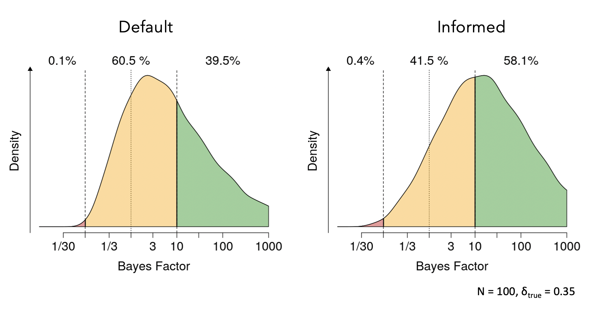
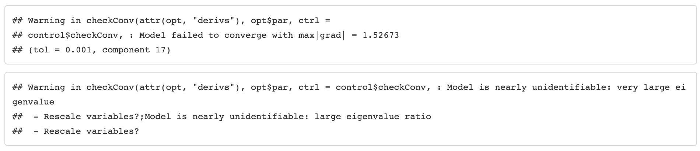
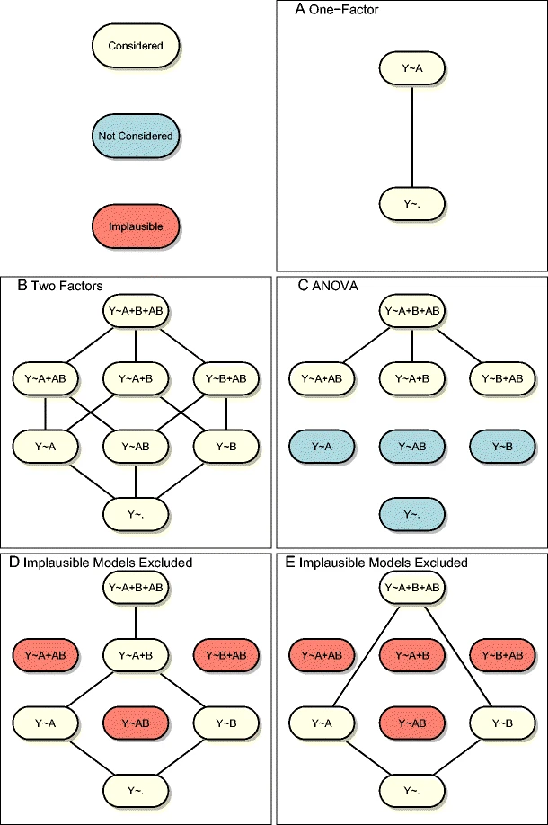

```{r setup, include=FALSE, echo = F}
knitr::opts_chunk$set(echo = F)

library("msm")
library("papaja")
library(diagram)
library(RColorBrewer)

mycols <- RColorBrewer::brewer.pal(8, "Dark2")
```

## Outline

1. Introduction to Bayesian inference
2. The `BayesFactor` package
3. $t$-Test
4. ANOVA
5. Linear model setup

# Introduction to Bayesian inference

## Example

>- Effect of media stories on attitudes towards Syrian refugees.
>- IV: Sympathetic media story about refugees or control stofy about food trends.
>- DV: Participants’ favorability ratings towards refugees.
>- Also recorded: Political affiliation of the participants.

<br>

<center>

</center>

<br>

Example from @Rouder:etal:2018

## Usual approach

>- Conduct a $t$-test to assess the effect of media stories on attitudes towards Syrian refugees.
>- Conduct a 2x2 ANOVA to assess the effects of both media stories and political affiliation as well as their interaction.
>- Neither necessarily match the research questions associated with the study.
>- Baysian model comparison allows to better match inference and theoretical questions.
>- But you can also do the regular stuff.

## Three main theoretical positions

>1. The plight of refugees generates an empathic response which results in an increase in favorability for conservative and liberals alike.
>2. Confirmation bias [@Tversky:Kahneman:1974]: People ignore media stories incompatible with their world view. Therefore, only liberals are affected.
>3. Belief polarization [@Cook:Lewandowsky:2016]: Liberals see refugees more favorably after viewing positive stories while conservatives might actually see them more negatively.

<center>

</center>

## Testing position 1

>- We need models

## Testing position 1

- We need models
- $\calM_1:$ The effect of media stories on attitudes is positive.

<br>

```{r, fig.asp = 0.7, fig.width=5}
par(cex = 1.2, mgp = c(2, .7, 0), mar = c(3,3,1,1))
x <- seq(-1.5, 1.5, .01)
y <- msm::dtnorm(x, 0, 0.7, lower = 0)
plot(x, y, type = "l", col = mycols[1]
     , lwd = 3, ylab = "Density", xlab = "Favorability effect"
     , ylim = c(0, 2), bty = "n")
```

## Testing position 1

- We need models
- $\calM_1:$ The effect of media stories on attitudes is positive.
- $\calM_0:$ There is no effect of media stories on attitudes.


```{r, fig.asp = 0.65, fig.width=6.5}
par(cex = 1.2, mgp = c(2, .7, 0), mar = c(3,3,1,1))
x <- seq(-1.5, 1.5, .01)
y <- msm::dtnorm(x, 0, 0.7, lower = 0)
plot(x, y, type = "l", col = mycols[1]
     , lwd = 3, ylab = "Density", xlab = "Favorability effect"
     , ylim = c(0, 2), bty = "n")
abline(v = 0, lwd = 3, lty = 2, col = mycols[4])
legend("topleft", legend = c(expression(M[1]: ~ "Positive effect"), expression(M[0]: ~ "No effect"))
       , lwd = 3, lty = 1:2, col = mycols[c(1, 4)], bty = "n", cex = 1)
```

## Testing position 1

>- The prior distribution indicates the plausibility of effects before the data have been collected.
>- Because we make this fine-grained specification, predictions are now possible.

```{r, fig.asp = 0.65, fig.width=6.5}
par(cex = 1.2, mgp = c(2, .7, 0), mar = c(3,3,1,1))
x <- seq(-1.5, 1.5, .01)
y <- msm::dtnorm(x, 0, 0.7, lower = 0)
plot(x, y, type = "l", col = mycols[1]
     , lwd = 3, ylab = "Density", xlab = "Favorability effect"
     , ylim = c(0, 2), bty = "n")
abline(v = 0, lwd = 3, lty = 2, col = mycols[4])
legend("topleft", legend = c(expression(M[1]: ~ "Positive effect"), expression(M[0]: ~ "No effect"))
       , lwd = 3, lty = 1:2, col = mycols[c(1, 4)], bty = "n", cex = 1)
```

## Testing position 1 | Evidence through predictions

>- In Bayesian statistics, evidence for models reflects how well they predict data.
>- Prior is on true values.
>- Predictions are on data.

## Testing position 1 | Evidence through predictions

- In Bayesian statistics, evidence for models reflects how well they predict data.

```{r teamA-pred, fig.asp = 0.65, fig.width=6.5, cache = T}
sd0 <- .6
sd1 <- .2

theta <- seq(-1.5, 1.5, .002)

noise <- function(theta) dnorm(theta, 0, sd1)   
tTruth <- function(theta, upper = Inf, lower = 0){
  dtnorm(theta, 0, sd0, upper = upper, lower = lower)  
}
# convolution integral
tEffect <- function(z, upper = Inf, lower = 0){
   integrate(function(x, z, up = upper, low = lower){
     tTruth(z - x, upper = up, lower = low) * noise(x)}
     , -Inf
     , Inf
     , z)$value 
}

pred <- data.frame(theta = rep(theta, 2)
           , Model = rep(c("Positive effect", "No effect"), each = length(theta))
           , Density = c(apply(matrix(theta), 1, tEffect), noise(theta)))

par(cex = 1.2, mgp = c(2, .7, 0), mar = c(3,3,1,1))
plot(theta, pred$Density[pred$Model == "Positive effect"], type = "l", col = mycols[1]
     , lwd = 3, ylab = "Density", xlab = "Observed favorability effect"
     , ylim = c(0, 2), bty = "n")
lines(theta, pred$Density[pred$Model == "No effect"], lwd = 3, lty = 2, col = mycols[4])
legend("topleft", legend = c(expression(M[1]: ~ "Positive effect"), expression(M[0]: ~ "No effect"))
       , lwd = 3, lty = 1:2, col = mycols[c(1, 4)], bty = "n", cex = 1)
```

## Testing position 1 | Evidence through predictions

- In Bayesian statistics, evidence for models reflects how well they predict data.

```{r teamA-pred-2, fig.asp = 0.65, fig.width=6.5, cache = T}
par(cex = 1.2, mgp = c(2, .7, 0), mar = c(3,3,1,1))
plot(theta, pred$Density[pred$Model == "Positive effect"], type = "l", col = mycols[1]
     , lwd = 3, ylab = "Density", xlab = "Observed favorability effect"
     , ylim = c(0, 2), bty = "n")
lines(theta, pred$Density[pred$Model == "No effect"], lwd = 3, lty = 2, col = mycols[4])
legend("topleft", legend = c(expression(M[1]: ~ "Positive effect"), expression(M[0]: ~ "No effect"))
       , lwd = 3, lty = 1:2, col = mycols[c(1, 4)], bty = "n", cex = 1)
polygon(x = c(-1.5, 0.23, 0.23, -1.5), y = c(0,0,2,2)
        , border = NA, col = adjustcolor(mycols[4], alpha.f = 0.1))
polygon(x = c(1.5, 0.23, 0.23, 1.5), y = c(0,0,2,2)
        , border = NA, col = adjustcolor(mycols[1], alpha.f = 0.1))
```

## Testing position 1 | Evidence through predictions

- In Bayesian statistics, evidence for models reflects how well they predict data.

```{r teamA-pred-3, fig.asp = 0.65, fig.width=6.5, cache = T}
par(cex = 1.2, mgp = c(2, .7, 0), mar = c(3,3,1,1))
plot(theta, pred$Density[pred$Model == "Positive effect"], type = "l", col = mycols[1]
     , lwd = 3, ylab = "Density", xlab = "Observed favorability effect"
     , ylim = c(0, 2), bty = "n")
lines(theta, pred$Density[pred$Model == "No effect"], lwd = 3, lty = 2, col = mycols[4])
legend("topleft", legend = c(expression(M[1]: ~ "Positive effect"), expression(M[0]: ~ "No effect"))
       , lwd = 3, lty = 1:2, col = mycols[c(1, 4)], bty = "n", cex = 1)
polygon(x = c(-1.5, 0.23, 0.23, -1.5), y = c(0,0,2,2)
        , border = NA, col = adjustcolor(mycols[4], alpha.f = 0.1))
polygon(x = c(1.5, 0.23, 0.23, 1.5), y = c(0,0,2,2)
        , border = NA, col = adjustcolor(mycols[1], alpha.f = 0.1))
abline(v = 0.4, lwd = 4, col = mycols[6])

dat.pt <- pred[round(pred$theta, 3) == 0.400,]
BF <- dat.pt$Density[1] / dat.pt$Density[2]
```

## Testing position 1 | Evidence through predictions

- In Bayesian statistics, evidence for models reflects how well they predict data.

```{r teamA-pred-4, fig.asp = 0.65, fig.width=6.5, cache = T}
par(cex = 1.2, mgp = c(2, .7, 0), mar = c(3,3,1,1))
plot(theta, pred$Density[pred$Model == "Positive effect"], type = "l", col = mycols[1]
     , lwd = 3, ylab = "Density", xlab = "Observed favorability effect"
     , ylim = c(0, 2), bty = "n")
lines(theta, pred$Density[pred$Model == "No effect"], lwd = 3, lty = 2, col = mycols[4])
legend("topleft", legend = c(expression(M[1]: ~ "Positive effect"), expression(M[0]: ~ "No effect"))
       , lwd = 3, lty = 1:2, col = mycols[c(1, 4)], bty = "n", cex = 1)
polygon(x = c(-1.5, 0.23, 0.23, -1.5), y = c(0,0,2,2)
        , border = NA, col = adjustcolor(mycols[4], alpha.f = 0.1))
polygon(x = c(1.5, 0.23, 0.23, 1.5), y = c(0,0,2,2)
        , border = NA, col = adjustcolor(mycols[1], alpha.f = 0.1))
abline(v = 0.4, lwd = 4, col = mycols[6])

dat.pt <- pred[round(pred$theta, 3) == 0.400,]
BF <- dat.pt$Density[1] / dat.pt$Density[2]
text(0.8, 1.5, labels = paste("BF =", round(BF, 2)), cex = 1.3)
```

# Bayesian model comparison in practice

## The BayesFactor package

>- Based on @Rouder:etal:2009a ($t$-test), @Rouder:etal:2012 (ANOVA), and @Rouder:Morey:2012 (regression), total of > 4000 citations.
>- Same setup is implemented in JASP and SPSS.
>- Provides a convenient interface for commonly used models.
>- Bayesian versions of typical frequentist tests using Bayes factor.

<br>

<center>

</center>

## The BayesFactor package | Functionality

- General linear models (including linear mixed effects models): `generalTestBF`, `lmBF`
- Linear regression: `regressionBF`, `lmBF`
- Linear correlation: `correlationBF`
- $t$-tests: `ttestBF`
- Meta-analytic $t$-tests: `meta.ttestBF`
- ANOVA: `anovaBF`, `lmBF`
- Contingency tables: `contingencyTableBF`
- Single proportions: `proportionBF`

## The BayesFactor package | Functionality

- **General linear models** (including linear mixed effects models): `generalTestBF`, `lmBF`
- Linear regression: `regressionBF`, `lmBF`
- Linear correlation: `correlationBF`
- **$t$-tests**: `ttestBF`
- Meta-analytic $t$-tests: `meta.ttestBF`
- **ANOVA**: `anovaBF`, `lmBF`
- Contingency tables: `contingencyTableBF`
- Single proportions: `proportionBF`

# $t$-Test

## $t$-Test

Can be used to test our position 1 .

Equation setup

## $t$-Test using BayesFactor

```{r}
set.seed(123)
source("R-code/generate_data.R")
immigration_study$story <- factor(immigration_study$story)
# write.csv(immigration_study, "data/dat_immigration.csv")
```

```{r, echo = T, eval = F}
BayesFactor::ttestBF(formula = attitude ~ story
                     , data = immigration_study)
```

## Prior settings

- $\calM_1:$ The effect of media stories on attitudes is positive.
- $\calM_0:$ There is no effect of media stories on attitudes.
>- Attitudes might be normally distributed: $Y_{ij} \sim \mbox{Normal}(\mu + x_j \theta, \sigma^2)$.
>- For model $\calM_0$ $\theta = 0$.
>- For model $\calM_1$ we need a prior on mu: $\theta$ 
>- Prior on $\sigma^2$ and $\mu$?

## Three reasons for using informed priors

## 1. You gotta know something

<div class="row">
  <div class="column">
<h4> You are... </h4>
<br>

>- A researcher in psychology.
>- Working in their field of expertise.
>- Standing on the shoulders of previous generations of researchers.

</div>
  <div class="column">
<br><br><br>


</div>
</div>

## 2. Informed priors $\rightarrow$ informative tests

Obtain strong evidence by increasing model discriminability.



<p style="font-size:18px">
@Stefan_etal2019
</p>

## 3. Informed priors ensure identifiability

- Complex models often suffer from identifiability issues.



- Informed priors introduce probabilistic constraints.

## The blessing of default priors

>- `BayesFactor` package in `R` and `JASP` use default priors for the t-test called JZS prior.
>- Prior structure is consistent.
>- User-defined prior settings are on the scale of the effect size:
>- $\delta = \theta / \sigma$ (think Cohen's $d$).

## The blessing of default priors

- `BayesFactor` package in `R` and `JASP` use default priors for the t-test called JZS prior.
- Prior structure is consistent.
- User-defined prior settings are on the scale of the effect size.

```{r, echo = T, eval = F}
BayesFactor::ttestBF(formula = attitude ~ story
                     , data = immigration_study
                     , rscale = 1 / sqrt(2))
```

## The blessing of default priors

```{r, echo = T, eval = F}
BayesFactor::ttestBF(formula = attitude ~ story
                     , data = immigration_study
                     , rscale = 1 / sqrt(2))
```

```{r, fig.asp = .7, fig.width=5.5}
par(mar = c(3,3,.5,.5), mgp = c(2,.7,0))
x <- seq(-3, 3, .01)
y <- dcauchy(x, 0, 1/sqrt(2))
plot(x, y, type = "l", lwd = 2
     , ylab = "Density", xlab = "Effect Size"
     , col = "darkblue", ylim = c(0, .5))
lines(x, dnorm(x), col = adjustcolor(1, .5), lty = 2, lwd = 2)
abline(v = c(-1, 0, 1), lwd = 0.5, col = adjustcolor(1, alpha.f = 0.3))
```

## The blessing of default priors

```{r, fig.asp = .7, fig.width=5.5, echo = T}
par(mar = c(3,3,.5,.5), mgp = c(2,.7,0))
x <- seq(-3, 3, .01)
y <- dcauchy(x, 0, 1/sqrt(2))
plot(x, y, type = "l", lwd = 2
     , ylab = "Density", xlab = "Effect Size"
     , col = "darkblue", ylim = c(0, .5))
lines(x, dnorm(x), col = adjustcolor(1, .5), lty = 2, lwd = 2)
abline(v = c(-1, 0, 1), lwd = 0.5, col = adjustcolor(1, alpha.f = 0.3))
```

## Prior prediction

```{r sim-pred-ttest, cache = T}
sim.pred.fun <- function(scale){
  delta <- rcauchy(1, location = 0, scale = scale)
  mu <- runif(1, -1000, 1000)
  s2 <- MCMCpack::rinvgamma(1, 0.5, 0.5)
  
  I <- 100
  cond <- rep(c(-0.5, 0.5), each = I)
  y <- rnorm(2 * I, mu + cond * delta * sqrt(s2), sqrt(s2))
  
  return(diff(tapply(y, cond, mean)))
}

res <- replicate(100000, sim.pred.fun(1/sqrt(2)))
round(quantile(res), 2)
```

## The blessing of default priors

```{r, echo = T, eval = F}
BayesFactor::ttestBF(formula = attitude ~ story
                     , data = immigration_study
                     , rscale = 1 / 4)
```

```{r, fig.asp = .7, fig.width=5.5}
par(mar = c(3,3,.5,.5), mgp = c(2,.7,0))
x <- seq(-3, 3, .01)
y <- dcauchy(x, 0, 1/sqrt(2))
plot(x, y, type = "l", lwd = 2
     , ylab = "Density", xlab = "Effect Size"
     , col = "darkblue", ylim = c(0, 1.5))
lines(x, dnorm(x), col = adjustcolor(1, .5), lty = 2, lwd = 2)
lines(x, dcauchy(x, 0, 1/4), col = "firebrick", lwd = 2)
abline(v = c(-1, 0, 1), lwd = 0.5, col = adjustcolor(1, alpha.f = 0.3))
```

## Your turn!

1. Plot the default prior on effect size.
2. Adjust the scale until it matches your expectations of the outcome of the study. 
3. Conduct a $t$-test using your setting.
4. Do you think any two people in the workshop get the same result?

<br>


## What was your scale setting?

Put your setting in the zoom chat!

<br>

<br>


## What was your scale setting?

```{r, fig.asp = .7, fig.width=5.5}
par(mar = c(3,3,.5,.5), mgp = c(2,.7,0))
x <- seq(-3, 3, .01)
y <- dcauchy(x, 0, 1/sqrt(2))
plot(x, y, type = "l", lwd = 2
     , ylab = "Density", xlab = "Effect Size"
     , col = "darkblue", ylim = c(0, .8))
lines(x, dnorm(x), col = adjustcolor(1, .5), lty = 2, lwd = 2)
lines(x, dcauchy(x, 0, 1/2), col = "firebrick", lwd = 2)
abline(v = c(-1, 0, 1), lwd = 0.5, col = adjustcolor(1, alpha.f = 0.3))
```

## $t$-Test using BayesFactor | Output

```{r, echo = T, eval = F}
BayesFactor::ttestBF(formula = attitude ~ story
                     , data = immigration_study
                     , rscale = 1 / 2)
```

## Back to media stories about refugees

The plight of refugees generates an empathic response which results in an increase in favorability for conservative and liberals alike.

>- Does the $t$-test as we used it address this statement?

## Estimating the effect

```{r est-ttest, echo = T, cache = T}
est.attitude <- BayesFactor::ttestBF(formula = attitude ~ story
                     , data = immigration_study, rscale = 1 / 2
                     , posterior = T, iterations = 20000)
plot(est.attitude[,"beta (Neutral - Refugee plight)"])
```

## Estimating the effect

```{r, warning=F, message=F}
par(cex = 1.2, mar = c(3,3,1,1), mgp = c(2, .7, 0))
plot(density(est.attitude[,"beta (Neutral - Refugee plight)"])
     , lwd = 3, col = mycols[3]
     , main = "", xlab = "Effect of media story"
     , bty = "n"
     , xlim = c(-1.2, .5))
dens <- density(est.attitude[,"beta (Neutral - Refugee plight)"])
dx <- mean(diff(dens$x))
y.unit <- sum(dens$y) * dx
dx <- dx / y.unit 
x.mean <- sum(dens$y * dens$x) * dx
y.mean <- dens$y[length(dens$x[dens$x < x.mean])] 
lines(rep(x.mean, 2), c(0, y.mean), lwd = 3, col = mycols[3]) 
```


## Back to media stories about refugees

The plight of refugees generates an empathic response which results in an increase in favorability for conservative and liberals alike.

- Does the $t$-test as we used it address this statement?

>- We need an ordinal constraint.
>- Ordinal constraint: Specification of the direction of an effect.

## One-sided tests with BayesFactor

- One-sided $t$-tests are easy with `BayesFactor`.

## One-sided tests with BayesFactor

- One-sided $t$-tests are easy with `BayesFactor`.

```{r, echo = T}
BayesFactor::ttestBF(formula = attitude ~ story
                     , data = immigration_study
                     , rscale = 1 / 2
                     , nullInterval = c(-Inf, 0))
```

## Your turn!

1. New data set, this time real data.
2. Run a Bayesian t-test, try out ordinal constraints and estimation, maybe even prior prediction.
3. As questions while I am here!

```{r echo = T, cache = T, eval = F}
SourceURL <- "https://raw.githubusercontent.com/PerceptionCognitionLab/data0/master
/contexteffects/FlankerStroopSimon/cleaning.R"
devtools::source_url(SourceURL)
```


## Your turn!

```{r echo = F, cache = T, message=F, warning=F, results='hide'}
SourceURL <- "https://raw.githubusercontent.com/PerceptionCognitionLab/data0/master/contexteffects/FlankerStroopSimon/cleaning.R"
devtools::source_url(SourceURL)
```

```{r eval = F, message=F, warning=F, results='hide'}
library(tidyverse)
stroop.agg <- stroop %>%
  group_by(ID, congruency) %>%
  summarize(mrt = mean(RT)) %>%
  spread(congruency, mrt)

BayesFactor::ttestBF(x = stroop.agg$incongruent
                     , y = stroop.agg$congruent
                     , paired = T)
est.stroop <- BayesFactor::ttestBF(x = stroop.agg$incongruent
                     , y = stroop.agg$congruent
                     , paired = T
                     , posterior = T, iterations = 20000)
plot(est.stroop[,"delta"])
```

```{r echo = T, message = F, warning = F}
library(tidyverse)

stroop.agg <- stroop %>%
  group_by(ID, congruency) %>%
  summarize(mrt = mean(RT)) %>%
  spread(congruency, mrt)
```


# Analysis of variance

## ANOVA

>- Based on @Rouder:etal:2012.
>- Between-subject, within-subject and mixed designs.
>- Random effects.
>- Perhaps the most thought out functionlity in BayesFactor.

## ANOVA models

<center>

</center>

## ANOVA parameterization

>- Extension to $t$-test.
>- Effects are parameterized as $\delta = \theta / \sigma$ (effect size).
>- Coding is orthonormal (depends on the number of levels per factor).
>- Most simple case is two levels: $x_1 = -1/\sqrt{2}, x_2 = 1/\sqrt{2}$.

## ANOVA in practice

```{r, echo = T, eval = F}
immigration_study$story <- factor(immigration_study$story)
immigration_study$political_affiliation <- factor(immigration_study$political_affiliation)
BayesFactor::anovaBF(formula = attitude ~ story * political_affiliation
                     , data = immigration_study)
```

## ANOVA in practice

- `rscaleEffects` = A named vector of prior settings for individual factors, overriding `rscaleFixed` and `rscaleRandom.` Values are scales, names are factor names.

```{r, echo = T, eval = F}
BayesFactor::anovaBF(formula = attitude ~ story * political_affiliation
                     , data = immigration_study
                     , rscaleEffects = c("story" = 1/2
                                         , "political_affiliation" = 1/2
                                         , "story:political_affiliation" = 1/3))
```

## Estimation

## Ordinal constraints

## Your turn!

# All the models

## Continuous predictors

## Bringing it all together

## Your turn

## Thank you!

<center>

</center>

<br>

<style>
slides > slide {
  overflow-x: auto !important;
  overflow-y: auto !important;
}
</style>

<style>
slides > slide:not(.nobackground):before {
  background: none;
}
</style>

<font size="3">
<div id = "refs"></div>
</font>


