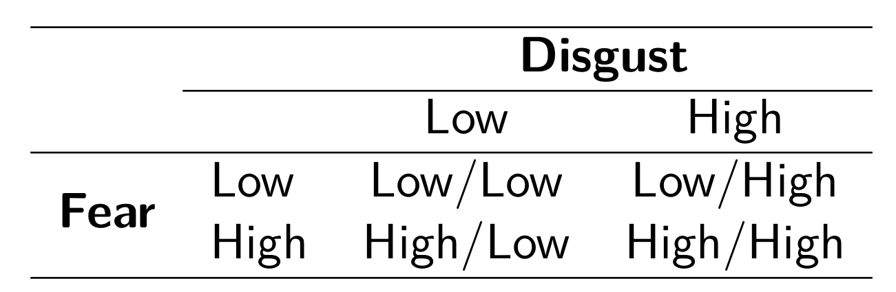
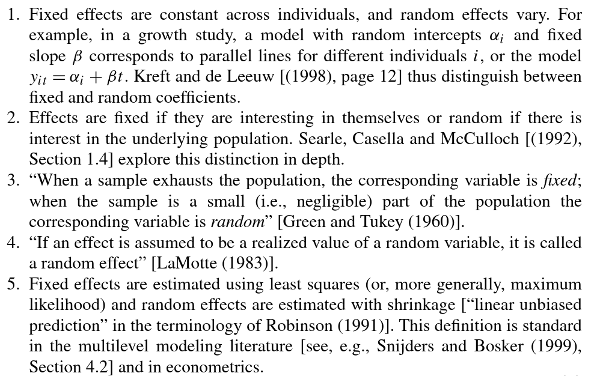

```{r setup, include=FALSE, echo = F}
knitr::opts_chunk$set(echo = F)

library(knitr)
library("msm")
library("papaja")
library(diagram)
library(RColorBrewer)
library("reshape2")

mycols <- RColorBrewer::brewer.pal(8, "Dark2")
```

## Slides and Material

You can find the slides (and additional materials) here:
[https://github.com/jstbcs/ws-bayesian-stats-r](https://github.com/jstbcs/ws-bayesian-stats-r).

## Outline

1. Ordinal constraints
2. Random effects
3. Does everyone?

# Ordinal constraints

## A psychologist's favorite design | With Ugly Bugs

```{r, out.width = "30%", fig.align='center'}

```

## A psychologist's favorite design |Ryan, Wilde, & Crist (2013)

```{r, out.width = "50%", out.extra = 'id="zoom-margin"', fig.align='center'}

```


>- **"How willing are you to kill/get rid of this bug?"**

## Systems of orders with bugs

```{r fig-1, fig.height=5.5, fig.width=9}
par(mar = c(0, 0, 2.5, 0))
layout(matrix(c(0, 1, 1, 1, 1, 0
                , 2, 2, 3, 3, 4, 4
                , 0, 5, 5, 6, 6, 0)
              , ncol = 6, byrow = T))

myCol <- c('lightblue', 'lavender', 'darkseagreen1', "mistyrose1")
names <- c("LL", "LH", "HL", "HH")
o <- 1:4

#Null model

M <- matrix(nrow = length(o), ncol = length(o), data=0)
M[1, 2] <- ''
M[2, 3] <- ''
M[3, 4] <- ''

plotmat(M
        , pos = c(4)
        , name = names
        , curve = 0
        , box.type="round"
        , box.size=.02
        , box.prop=1
        , box.col = myCol
        , arr.length=0
        , box.cex = 1.2
        , shadow.size = 0.007
        )
mtext(expression(M[0]: ~ "Null"), side = 3, cex = 1.5, line = -2)

#Additive model

M <- matrix(nrow = length(o), ncol = length(o), data=0)
M[1, 2] <- ''
M[1, 3] <- ''
M[2, 4] <- ''
M[3, 4] <- ''

plot(0, type='n', axes=FALSE, ann=FALSE)
mtext(expression(M[1]: ~ "Consistent +"), side = 3, cex = 1.5)

M <- matrix(nrow = length(o), ncol = length(o), data=0)
M[1, 2] <- ''
M[2, 3] <- ''
M[1, 4] <- ''
M[2, 4] <- ''
M[3, 4] <- ''

plot(0, type='n', axes=FALSE, ann=FALSE)
mtext(expression(M[2]: ~ "+ Equality"), side = 3, cex = 1.5)

#Fear only

M <- matrix(nrow = length(o), ncol = length(o), data=0)
M[1, 2] <- ''
M[1, 3] <- ''
M[2, 4] <- ''
M[3, 4] <- ''

plot(0, type='n', axes=FALSE, ann=FALSE)
mtext(expression(M[3]: ~ "Fear Only"), side = 3, cex = 1.5)

#Disgust only

M <- matrix(nrow = length(o), ncol = length(o), data=0)
M[1, 2] <- ''
M[1, 3] <- ''
M[2, 4] <- ''
M[3, 4] <- ''

plot(0, type='n', axes=FALSE, ann=FALSE)
mtext(expression(M[4]: ~ "Disgust Only"), side = 3, cex = 1.5)

#Unconstrained

M <- matrix(nrow = length(o), ncol = length(o), data=0)

plot(0, type='n', axes=FALSE, ann=FALSE)
mtext(expression(M[5]: ~ "Unconstrained"), side = 3, cex = 1.5)
```

## Systems of orders with bugs

```{r, fig.height=5.5, fig.width=9}
par(mar = c(0, 0, 2.5, 0))
layout(matrix(c(0, 1, 1, 1, 1, 0
                , 2, 2, 3, 3, 4, 4
                , 0, 5, 5, 6, 6, 0)
              , ncol = 6, byrow = T))

myCol <- c('lightblue', 'lavender', 'darkseagreen1', "mistyrose1")
names <- c("LL", "LH", "HL", "HH")
o <- 1:4

#Null model

M <- matrix(nrow = length(o), ncol = length(o), data=0)
M[1, 2] <- ''
M[2, 3] <- ''
M[3, 4] <- ''

plotmat(M
        , pos = c(4)
        , name = names
        , curve = 0
        , box.type="round"
        , box.size=.02
        , box.prop=1
        , box.col = myCol
        , arr.length=0
        , box.cex = 1.2
        , shadow.size = 0.007
        )
mtext(expression(M[0]: ~ "Null"), side = 3, cex = 1.5, line = -2)

#Additive model

M <- matrix(nrow = length(o), ncol = length(o), data=0)
M[1, 2] <- ''
M[1, 3] <- ''
M[2, 4] <- ''
M[3, 4] <- ''

plotmat(M
        , pos = c(1, 2, 1)
        , name = names[c(4, 2, 3, 1)]
        , curve = 0
        , box.type="round"
        , box.size=.06
        , box.prop=.8
        , box.col = myCol[c(4, 2, 3, 1)]
        , arr.length=0
        , box.cex = 1.2
        , relsize = 1
        , shadow.size = 0.007
        )
# plot(0, type='n', axes=FALSE, ann=FALSE)
mtext(expression(M[1]: ~ "Consistent +"), side = 3, cex = 1.5)

# #Compensatory
# 
# M <- matrix(nrow = length(o), ncol = length(o), data=0)
# M[1, 4] <- ''
# M[2, 4] <- ''
# M[3, 4] <- ''
# 
# # plotmat(M
# #         , pos = c(3, 1)
# #         , name = names[c(2, 4, 3, 1)]
# #         , curve = 0
# #         , box.type="round"
# #         , box.size=.06
# #         , box.prop=.8
# #         , box.col = myCol
# #         , arr.length=0
# #         , box.cex = 1.2
# #         , relsize = 1
# #         )
# plot(0, type='n', axes=FALSE, ann=FALSE)
# mtext(expression(M[2]: ~ "Compensatory"), side = 3, cex = 1.5)

#Compensatory strict

M <- matrix(nrow = length(o), ncol = length(o), data=0)
M[1, 2] <- ''
M[2, 3] <- ''
M[1, 4] <- ''
M[2, 4] <- ''
M[3, 4] <- ''

# plotmat(M
#         , pos = c(3, 1)
#         , name = names[c(2, 4, 3, 1)]
#         , curve = 0
#         , box.type="round"
#         , box.size=.06
#         , box.prop=.8
#         , box.col = myCol
#         , arr.length=0
#         , box.cex = 1.2
#         , relsize = 1
#         )
plot(0, type='n', axes=FALSE, ann=FALSE)

mtext(expression(M[2]: ~ "+ Equality"), side = 3, cex = 1.5)

#Fear only

M <- matrix(nrow = length(o), ncol = length(o), data=0)
M[1, 2] <- ''
M[1, 3] <- ''
M[2, 4] <- ''
M[3, 4] <- ''

# plotmat(M
#         , pos = c(2, 2)
#         , name = names[c(3, 4, 1, 2)]
#         , curve = 0
#         , box.type="round"
#         , box.size=.06
#         , box.prop=.8
#         , box.col = myCol
#         , arr.length=0
#         , box.cex = 1.2
#         , relsize = 1
#         )
plot(0, type='n', axes=FALSE, ann=FALSE)
mtext(expression(M[3]: ~ "Fear Only"), side = 3, cex = 1.5)

#Disgust only

M <- matrix(nrow = length(o), ncol = length(o), data=0)
M[1, 2] <- ''
M[1, 3] <- ''
M[2, 4] <- ''
M[3, 4] <- ''

# plotmat(M
#         , pos = c(2, 2)
#         , name = names[c(2, 4, 1, 3)]
#         , curve = 0
#         , box.type="round"
#         , box.size=.06
#         , box.prop=.8
#         , box.col = myCol
#         , arr.length=0
#         , box.cex = 1.2
#         , relsize = 1
#         )
plot(0, type='n', axes=FALSE, ann=FALSE)
mtext(expression(M[4]: ~ "Disgust Only"), side = 3, cex = 1.5)

#Unconstrained

M <- matrix(nrow = length(o), ncol = length(o), data=0)

# plotmat(M
#         , pos = c(1, 2, 1)
#         , name = names[c(4, 2, 3, 1)]
#         , curve = 0
#         , box.type="round"
#         , box.size=.06
#         , box.prop=.8
#         , box.col = myCol
#         , arr.length=0
#         , box.cex = 1.2
#         , relsize = 1
#         )
plot(0, type='n', axes=FALSE, ann=FALSE)
mtext(expression(M[5]: ~ "Unconstrained"), side = 3, cex = 1.5)
```

## Systems of orders with bugs

```{r, fig.height=5.5, fig.width=9}
par(mar = c(0, 0, 2.5, 0))
layout(matrix(c(0, 1, 1, 1, 1, 0
                , 2, 2, 3, 3, 4, 4
                , 0, 5, 5, 6, 6, 0)
              , ncol = 6, byrow = T))

myCol <- c('lightblue', 'lavender', 'darkseagreen1', "mistyrose1")
names <- c("LL", "LH", "HL", "HH")
o <- 1:4

#Null model

M <- matrix(nrow = length(o), ncol = length(o), data=0)
M[1, 2] <- ''
M[2, 3] <- ''
M[3, 4] <- ''

plotmat(M
        , pos = c(4)
        , name = names
        , curve = 0
        , box.type="round"
        , box.size=.02
        , box.prop=1
        , box.col = myCol
        , arr.length=0
        , box.cex = 1.2
        , shadow.size = 0.007
        )
mtext(expression(M[0]: ~ "Null"), side = 3, cex = 1.5, line = -2)

#Additive model

M <- matrix(nrow = length(o), ncol = length(o), data=0)
M[1, 2] <- ''
M[1, 3] <- ''
M[2, 4] <- ''
M[3, 4] <- ''

plotmat(M
        , pos = c(1, 2, 1)
        , name = names[c(4, 2, 3, 1)]
        , curve = 0
        , box.type="round"
        , box.size=.06
        , box.prop=.8
        , box.col = myCol[c(4, 2, 3, 1)]
        , arr.length=0
        , box.cex = 1.2
        , relsize = 1
        , shadow.size = 0.007
        )
# plot(0, type='n', axes=FALSE, ann=FALSE)
mtext(expression(M[1]: ~ "Consistent +"), side = 3, cex = 1.5)

# #Compensatory
# 
# M <- matrix(nrow = length(o), ncol = length(o), data=0)
# M[1, 4] <- ''
# M[2, 4] <- ''
# M[3, 4] <- ''
# 
# plotmat(M
#         , pos = c(3, 1)
#         , name = names[c(2, 4, 3, 1)]
#         , curve = 0
#         , box.type="round"
#         , box.size=.06
#         , box.prop=.8
#         , box.col = myCol[c(2, 4, 3, 1)]
#         , arr.length=0
#         , box.cex = 1.2
#         , relsize = 1
#         )
# # plot(0, type='n', axes=FALSE, ann=FALSE)
# mtext(expression(M[2]: ~ "Compensatory"), side = 3, cex = 1.5)

#Compensatory strict

M <- matrix(nrow = length(o), ncol = length(o), data=0)
M[1, 2] <- ''
M[2, 3] <- ''
M[1, 4] <- ''
M[2, 4] <- ''
M[3, 4] <- ''

plotmat(M
        , pos = c(3, 1)
        , name = names[c(2, 4, 3, 1)]
        , curve = 0
        , box.type="round"
        , box.size=.06
        , box.prop=.8
        , box.col = myCol[c(2, 4, 3, 1)]
        , arr.length=0
        , box.cex = 1.2
        , relsize = 1
        , shadow.size = 0.007
        )
# plot(0, type='n', axes=FALSE, ann=FALSE)
mtext(expression(M[2]: ~ "+ Equality"), side = 3, cex = 1.5)

#Fear only

M <- matrix(nrow = length(o), ncol = length(o), data=0)
M[1, 2] <- ''
M[1, 3] <- ''
M[2, 4] <- ''
M[3, 4] <- ''

# plotmat(M
#         , pos = c(2, 2)
#         , name = names[c(3, 4, 1, 2)]
#         , curve = 0
#         , box.type="round"
#         , box.size=.06
#         , box.prop=.8
#         , box.col = myCol
#         , arr.length=0
#         , box.cex = 1.2
#         , relsize = 1
#         )
plot(0, type='n', axes=FALSE, ann=FALSE)
mtext(expression(M[3]: ~ "Fear Only"), side = 3, cex = 1.5)

#Disgust only

M <- matrix(nrow = length(o), ncol = length(o), data=0)
M[1, 2] <- ''
M[1, 3] <- ''
M[2, 4] <- ''
M[3, 4] <- ''

# plotmat(M
#         , pos = c(2, 2)
#         , name = names[c(2, 4, 1, 3)]
#         , curve = 0
#         , box.type="round"
#         , box.size=.06
#         , box.prop=.8
#         , box.col = myCol
#         , arr.length=0
#         , box.cex = 1.2
#         , relsize = 1
#         )
plot(0, type='n', axes=FALSE, ann=FALSE)
mtext(expression(M[4]: ~ "Disgust Only"), side = 3, cex = 1.5)

#Unconstrained

M <- matrix(nrow = length(o), ncol = length(o), data=0)

# plotmat(M
#         , pos = c(1, 2, 1)
#         , name = names[c(4, 2, 3, 1)]
#         , curve = 0
#         , box.type="round"
#         , box.size=.06
#         , box.prop=.8
#         , box.col = myCol
#         , arr.length=0
#         , box.cex = 1.2
#         , relsize = 1
#         )
plot(0, type='n', axes=FALSE, ann=FALSE)
mtext(expression(M[5]: ~ "Unconstrained"), side = 3, cex = 1.5)
```

## Systems of orders with bugs

```{r, fig.height=5.5, fig.width=9}
par(mar = c(0, 0, 2.5, 0))
layout(matrix(c(0, 1, 1, 1, 1, 0
                , 2, 2, 3, 3, 4, 4
                , 0, 5, 5, 6, 6, 0)
              , ncol = 6, byrow = T))

myCol <- c('lightblue', 'lavender', 'darkseagreen1', "mistyrose1")
names <- c("LL", "LH", "HL", "HH")
o <- 1:4

#Null model

M <- matrix(nrow = length(o), ncol = length(o), data=0)
M[1, 2] <- ''
M[2, 3] <- ''
M[3, 4] <- ''

plotmat(M
        , pos = c(4)
        , name = names
        , curve = 0
        , box.type="round"
        , box.size=.02
        , box.prop=1
        , box.col = myCol
        , arr.length=0
        , box.cex = 1.2
        , shadow.size = 0.007
        )
mtext(expression(M[0]: ~ "Null"), side = 3, cex = 1.5, line = -2)

#Additive model

M <- matrix(nrow = length(o), ncol = length(o), data=0)
M[1, 2] <- ''
M[1, 3] <- ''
M[2, 4] <- ''
M[3, 4] <- ''

plotmat(M
        , pos = c(1, 2, 1)
        , name = names[c(4, 2, 3, 1)]
        , curve = 0
        , box.type="round"
        , box.size=.06
        , box.prop=.8
        , box.col = myCol[c(4, 2, 3, 1)]
        , arr.length=0
        , box.cex = 1.2
        , relsize = 1
        , shadow.size = 0.007
        )
# plot(0, type='n', axes=FALSE, ann=FALSE)
mtext(expression(M[1]: ~ "Consistent +"), side = 3, cex = 1.5)

# #Compensatory
# 
# M <- matrix(nrow = length(o), ncol = length(o), data=0)
# M[1, 4] <- ''
# M[2, 4] <- ''
# M[3, 4] <- ''
# 
# plotmat(M
#         , pos = c(3, 1)
#         , name = names[c(2, 4, 3, 1)]
#         , curve = 0
#         , box.type="round"
#         , box.size=.06
#         , box.prop=.8
#         , box.col = myCol[c(2, 4, 3, 1)]
#         , arr.length=0
#         , box.cex = 1.2
#         , relsize = 1
#         )
# # plot(0, type='n', axes=FALSE, ann=FALSE)
# mtext(expression(M[2]: ~ "Compensatory"), side = 3, cex = 1.5)

#Compensatory strict

M <- matrix(nrow = length(o), ncol = length(o), data=0)
M[1, 2] <- ''
M[2, 3] <- ''
M[1, 4] <- ''
M[2, 4] <- ''
M[3, 4] <- ''

plotmat(M
        , pos = c(3, 1)
        , name = names[c(2, 4, 3, 1)]
        , curve = 0
        , box.type="round"
        , box.size=.06
        , box.prop=.8
        , box.col = myCol[c(2, 4, 3, 1)]
        , arr.length=0
        , box.cex = 1.2
        , relsize = 1
        , shadow.size = 0.007
        )
# plot(0, type='n', axes=FALSE, ann=FALSE)
mtext(expression(M[2]: ~ "+ Equality"), side = 3, cex = 1.5)

#Fear only

M <- matrix(nrow = length(o), ncol = length(o), data=0)
M[1, 2] <- ''
M[1, 3] <- ''
M[2, 4] <- ''
M[3, 4] <- ''

plotmat(M
        , pos = c(2, 2)
        , name = names[c(3, 4, 1, 2)]
        , curve = 0
        , box.type="round"
        , box.size=.06
        , box.prop=.8
        , box.col = myCol[c(3, 4, 1, 2)]
        , arr.length=0
        , box.cex = 1.2
        , relsize = 1
        , shadow.size = 0.007
        )
# plot(0, type='n', axes=FALSE, ann=FALSE)
mtext(expression(M[3]: ~ "Fear Only"), side = 3, cex = 1.5)

#Disgust only

M <- matrix(nrow = length(o), ncol = length(o), data=0)
M[1, 2] <- ''
M[1, 3] <- ''
M[2, 4] <- ''
M[3, 4] <- ''

# plotmat(M
#         , pos = c(2, 2)
#         , name = names[c(2, 4, 1, 3)]
#         , curve = 0
#         , box.type="round"
#         , box.size=.06
#         , box.prop=.8
#         , box.col = myCol
#         , arr.length=0
#         , box.cex = 1.2
#         , relsize = 1
#         )
plot(0, type='n', axes=FALSE, ann=FALSE)
mtext(expression(M[4]: ~ "Disgust Only"), side = 3, cex = 1.5)

#Unconstrained

M <- matrix(nrow = length(o), ncol = length(o), data=0)

# plotmat(M
#         , pos = c(1, 2, 1)
#         , name = names[c(4, 2, 3, 1)]
#         , curve = 0
#         , box.type="round"
#         , box.size=.06
#         , box.prop=.8
#         , box.col = myCol
#         , arr.length=0
#         , box.cex = 1.2
#         , relsize = 1
#         )
plot(0, type='n', axes=FALSE, ann=FALSE)
mtext(expression(M[5]: ~ "Unconstrained"), side = 3, cex = 1.5)
```

## Systems of orders with bugs

```{r, fig.height=5.5, fig.width=9}
par(mar = c(0, 0, 2.5, 0))
layout(matrix(c(0, 1, 1, 1, 1, 0
                , 2, 2, 3, 3, 4, 4
                , 0, 5, 5, 6, 6, 0)
              , ncol = 6, byrow = T))

myCol <- c('lightblue', 'lavender', 'darkseagreen1', "mistyrose1")
names <- c("LL", "LH", "HL", "HH")
o <- 1:4

#Null model

M <- matrix(nrow = length(o), ncol = length(o), data=0)
M[1, 2] <- ''
M[2, 3] <- ''
M[3, 4] <- ''

plotmat(M
        , pos = c(4)
        , name = names
        , curve = 0
        , box.type="round"
        , box.size=.02
        , box.prop=1
        , box.col = myCol
        , arr.length=0
        , box.cex = 1.2
        , shadow.size = 0.007
        )
mtext(expression(M[0]: ~ "Null"), side = 3, cex = 1.5, line = -2)

#Additive model

M <- matrix(nrow = length(o), ncol = length(o), data=0)
M[1, 2] <- ''
M[1, 3] <- ''
M[2, 4] <- ''
M[3, 4] <- ''

plotmat(M
        , pos = c(1, 2, 1)
        , name = names[c(4, 2, 3, 1)]
        , curve = 0
        , box.type="round"
        , box.size=.06
        , box.prop=.8
        , box.col = myCol[c(4, 2, 3, 1)]
        , arr.length=0
        , box.cex = 1.2
        , relsize = 1
        , shadow.size = 0.007
        )
# plot(0, type='n', axes=FALSE, ann=FALSE)
mtext(expression(M[1]: ~ "Consistent +"), side = 3, cex = 1.5)

# #Compensatory
# 
# M <- matrix(nrow = length(o), ncol = length(o), data=0)
# M[1, 4] <- ''
# M[2, 4] <- ''
# M[3, 4] <- ''
# 
# plotmat(M
#         , pos = c(3, 1)
#         , name = names[c(2, 4, 3, 1)]
#         , curve = 0
#         , box.type="round"
#         , box.size=.06
#         , box.prop=.8
#         , box.col = myCol[c(2, 4, 3, 1)]
#         , arr.length=0
#         , box.cex = 1.2
#         , relsize = 1
#         )
# # plot(0, type='n', axes=FALSE, ann=FALSE)
# mtext(expression(M[2]: ~ "Compensatory"), side = 3, cex = 1.5)

#Compensatory strict

M <- matrix(nrow = length(o), ncol = length(o), data=0)
M[1, 2] <- ''
M[2, 3] <- ''
M[1, 4] <- ''
M[2, 4] <- ''
M[3, 4] <- ''

plotmat(M
        , pos = c(3, 1)
        , name = names[c(2, 4, 3, 1)]
        , curve = 0
        , box.type="round"
        , box.size=.06
        , box.prop=.8
        , box.col = myCol[c(2, 4, 3, 1)]
        , arr.length=0
        , box.cex = 1.2
        , relsize = 1
        , shadow.size = 0.007
        )
# plot(0, type='n', axes=FALSE, ann=FALSE)
mtext(expression(M[2]: ~ "+ Equality"), side = 3, cex = 1.5)

#Fear only

M <- matrix(nrow = length(o), ncol = length(o), data=0)
M[1, 2] <- ''
M[1, 3] <- ''
M[2, 4] <- ''
M[3, 4] <- ''

plotmat(M
        , pos = c(2, 2)
        , name = names[c(3, 4, 1, 2)]
        , curve = 0
        , box.type="round"
        , box.size=.06
        , box.prop=.8
        , box.col = myCol[c(3, 4, 1, 2)]
        , arr.length=0
        , box.cex = 1.2
        , relsize = 1
        , shadow.size = 0.007
        )
# plot(0, type='n', axes=FALSE, ann=FALSE)
mtext(expression(M[3]: ~ "Fear Only"), side = 3, cex = 1.5)

#Disgust only

M <- matrix(nrow = length(o), ncol = length(o), data=0)
M[1, 2] <- ''
M[1, 3] <- ''
M[2, 4] <- ''
M[3, 4] <- ''

plotmat(M
        , pos = c(2, 2)
        , name = names[c(2, 4, 1, 3)]
        , curve = 0
        , box.type="round"
        , box.size=.06
        , box.prop=.8
        , box.col = myCol[c(2, 4, 1, 3)]
        , arr.length=0
        , box.cex = 1.2
        , relsize = 1
        , shadow.size = 0.007
        )
# plot(0, type='n', axes=FALSE, ann=FALSE)
mtext(expression(M[4]: ~ "Disgust Only"), side = 3, cex = 1.5)

#Unconstrained

M <- matrix(nrow = length(o), ncol = length(o), data=0)

# plotmat(M
#         , pos = c(1, 2, 1)
#         , name = names[c(4, 2, 3, 1)]
#         , curve = 0
#         , box.type="round"
#         , box.size=.06
#         , box.prop=.8
#         , box.col = myCol
#         , arr.length=0
#         , box.cex = 1.2
#         , relsize = 1
#         )
plot(0, type='n', axes=FALSE, ann=FALSE)
mtext(expression(M[5]: ~ "Unconstrained"), side = 3, cex = 1.5)
```

## Systems of orders with bugs

```{r, fig.height=5.5, fig.width=9}
par(mar = c(0, 0, 2.5, 0))
layout(matrix(c(0, 1, 1, 1, 1, 0
                , 2, 2, 3, 3, 4, 4
                , 0, 5, 5, 6, 6, 0)
              , ncol = 6, byrow = T))

myCol <- c('lightblue', 'lavender', 'darkseagreen1', "mistyrose1")
names <- c("LL", "LH", "HL", "HH")
o <- 1:4

#Null model

M <- matrix(nrow = length(o), ncol = length(o), data=0)
M[1, 2] <- ''
M[2, 3] <- ''
M[3, 4] <- ''

plotmat(M
        , pos = c(4)
        , name = names
        , curve = 0
        , box.type="round"
        , box.size=.02
        , box.prop=1
        , box.col = myCol
        , arr.length=0
        , box.cex = 1.2
        , shadow.size = 0.007
        )
mtext(expression(M[0]: ~ "Null"), side = 3, cex = 1.5, line = -2)

#Additive model

M <- matrix(nrow = length(o), ncol = length(o), data=0)
M[1, 2] <- ''
M[1, 3] <- ''
M[2, 4] <- ''
M[3, 4] <- ''

plotmat(M
        , pos = c(1, 2, 1)
        , name = names[c(4, 2, 3, 1)]
        , curve = 0
        , box.type="round"
        , box.size=.06
        , box.prop=.8
        , box.col = myCol[c(4, 2, 3, 1)]
        , arr.length=0
        , box.cex = 1.2
        , relsize = 1
        , shadow.size = 0.007
        )
# plot(0, type='n', axes=FALSE, ann=FALSE)
mtext(expression(M[1]: ~ "Consistent +"), side = 3, cex = 1.5)

# #Compensatory
# 
# M <- matrix(nrow = length(o), ncol = length(o), data=0)
# M[1, 4] <- ''
# M[2, 4] <- ''
# M[3, 4] <- ''
# 
# plotmat(M
#         , pos = c(3, 1)
#         , name = names[c(2, 4, 3, 1)]
#         , curve = 0
#         , box.type="round"
#         , box.size=.06
#         , box.prop=.8
#         , box.col = myCol[c(2, 4, 3, 1)]
#         , arr.length=0
#         , box.cex = 1.2
#         , relsize = 1
#         )
# # plot(0, type='n', axes=FALSE, ann=FALSE)
# mtext(expression(M[2]: ~ "Compensatory"), side = 3, cex = 1.5)

#Compensatory strict

M <- matrix(nrow = length(o), ncol = length(o), data=0)
M[1, 2] <- ''
M[2, 3] <- ''
M[1, 4] <- ''
M[2, 4] <- ''
M[3, 4] <- ''

plotmat(M
        , pos = c(3, 1)
        , name = names[c(2, 4, 3, 1)]
        , curve = 0
        , box.type="round"
        , box.size=.06
        , box.prop=.8
        , box.col = myCol[c(2, 4, 3, 1)]
        , arr.length=0
        , box.cex = 1.2
        , relsize = 1
        , shadow.size = 0.007
        )
# plot(0, type='n', axes=FALSE, ann=FALSE)
mtext(expression(M[2]: ~ "+ Equality"), side = 3, cex = 1.5)

#Fear only

M <- matrix(nrow = length(o), ncol = length(o), data=0)
M[1, 2] <- ''
M[1, 3] <- ''
M[2, 4] <- ''
M[3, 4] <- ''

plotmat(M
        , pos = c(2, 2)
        , name = names[c(3, 4, 1, 2)]
        , curve = 0
        , box.type="round"
        , box.size=.06
        , box.prop=.8
        , box.col = myCol[c(3, 4, 1, 2)]
        , arr.length=0
        , box.cex = 1.2
        , relsize = 1
        , shadow.size = 0.007
        )
# plot(0, type='n', axes=FALSE, ann=FALSE)
mtext(expression(M[3]: ~ "Fear Only"), side = 3, cex = 1.5)

#Disgust only

M <- matrix(nrow = length(o), ncol = length(o), data=0)
M[1, 2] <- ''
M[1, 3] <- ''
M[2, 4] <- ''
M[3, 4] <- ''

plotmat(M
        , pos = c(2, 2)
        , name = names[c(2, 4, 1, 3)]
        , curve = 0
        , box.type="round"
        , box.size=.06
        , box.prop=.8
        , box.col = myCol[c(2, 4, 1, 3)]
        , arr.length=0
        , box.cex = 1.2
        , relsize = 1
        , shadow.size = 0.007
        )
# plot(0, type='n', axes=FALSE, ann=FALSE)
mtext(expression(M[4]: ~ "Disgust Only"), side = 3, cex = 1.5)

#Unconstrained

M <- matrix(nrow = length(o), ncol = length(o), data=0)

plotmat(M
        , pos = c(1, 2, 1)
        , name = names[c(4, 2, 3, 1)]
        , curve = 0
        , box.type="round"
        , box.size=.06
        , box.prop=.8
        , box.col = myCol[c(4, 2, 3, 1)]
        , arr.length=0
        , box.cex = 1.2
        , relsize = 1
        , shadow.size = 0.007
        )
# plot(0, type='n', axes=FALSE, ann=FALSE)
mtext(expression(M[5]: ~ "Unconstrained"), side = 3, cex = 1.5)
```

## Systems of orders plot

```{r echo = T, fig.width=3, fig.asp=.8}
par(mar = c(0, 0, 0, 0))
names <- c("LL", "LH", "HL", "HH")
o <- 1:4
M <- matrix(nrow = length(o), ncol = length(o), data=0)
M[1, 2] <- ''; M[1, 3] <- ''; M[2, 4] <- ''; M[3, 4] <- ''

plotmat(M, pos = c(1, 2, 1), name = names[c(4, 2, 3, 1)]
        , curve = 0, box.type="round", box.size=.06, box.prop=.8
        , box.col = myCol[c(4, 2, 3, 1)], arr.length=0, box.cex = 1.2
        , relsize = 1, shadow.size = 0.007)
```

## Ordinal constraint before seing the data

>- For a Bayesian analysis with ordinal constraints we need to know the prior probability of the constraint.
>- Encompassing model: A model that has all the equality constraints but let's the order free to vary.
>- Restricted model space is the proportion of the prior probability space of the encompassing model that is in line with the ordinal constraint.

## Let's start simple

```{r fig.width=2.5, fig.asp = .8}
par(mar=c(0,0,2.5,0))
M <- matrix(nrow = length(o), ncol = length(o), data=0)
M[1, 2] <- ''
M[1, 3] <- ''
M[2, 4] <- ''
M[3, 4] <- ''

plotmat(M
        , pos = c(2, 2)
        , name = names[c(2, 4, 1, 3)]
        , curve = 0
        , box.type="round"
        , box.size=.06
        , box.prop=.8
        , box.col = myCol[c(2, 4, 1, 3)]
        , arr.length=0
        , box.cex = 1.2
        , relsize = 1
        , shadow.size = 0.007
        )
# plot(0, type='n', axes=FALSE, ann=FALSE)
mtext(expression(M[4]: ~ "Disgust Only"), side = 3, cex = 1.5)
```

>- What is the encompassing model?
>- What is prior probability space of the restricted model?

## A bit more complicated

```{r fig.width=2.5, fig.asp = .8}
par(mar=c(0,0,2.5,0))
M <- matrix(nrow = length(o), ncol = length(o), data=0)
M[1, 2] <- ''
M[1, 3] <- ''
M[2, 4] <- ''
M[3, 4] <- ''

plotmat(M
        , pos = c(1, 2, 1)
        , name = names[c(4, 2, 3, 1)]
        , curve = 0
        , box.type="round"
        , box.size=.06
        , box.prop=.8
        , box.col = myCol[c(4, 2, 3, 1)]
        , arr.length=0
        , box.cex = 1.2
        , relsize = 1
        , shadow.size = 0.007
        )
# plot(0, type='n', axes=FALSE, ann=FALSE)
mtext(expression(M[1]: ~ "Consistent +"), side = 3, cex = 1.5)
```

>- What is the encompassing model?
>- What is prior probability space of the restricted model?

## A bit more complicated

```{r fig.width=2.5, fig.asp = .8}
par(mar=c(0,0,2.5,0))
M <- matrix(nrow = length(o), ncol = length(o), data=0)
M[1, 2] <- ''
M[1, 3] <- ''
M[2, 4] <- ''
M[3, 4] <- ''

plotmat(M
        , pos = c(1, 2, 1)
        , name = names[c(4, 2, 3, 1)]
        , curve = 0
        , box.type="round"
        , box.size=.06
        , box.prop=.8
        , box.col = myCol[c(4, 2, 3, 1)]
        , arr.length=0
        , box.cex = 1.2
        , relsize = 1
        , shadow.size = 0.007
        )
# plot(0, type='n', axes=FALSE, ann=FALSE)
mtext(expression(M[1]: ~ "Consistent +"), side = 3, cex = 1.5)
```

Option 1

## A bit more complicated

```{r fig.width=2.5, fig.asp = .8}
par(mar=c(0,0,2.5,0))
M <- matrix(nrow = length(o), ncol = length(o), data=0)
M[1, 2] <- ''
M[1, 3] <- ''
M[2, 4] <- ''
M[3, 4] <- ''

plotmat(M
        , pos = c(1, 2, 1)
        , name = names[c(4, 2, 3, 1)]
        , curve = 0
        , box.type="round"
        , box.size=.06
        , box.prop=.8
        , box.col = myCol[c(4, 2, 3, 1)]
        , arr.length=0
        , box.cex = 1.2
        , relsize = 1
        , shadow.size = 0.007
        )
# plot(0, type='n', axes=FALSE, ann=FALSE)
mtext(expression(M[1]: ~ "Consistent +"), side = 3, cex = 1.5)
```

Option 1

```{r echo = T}
M <- 100000
LL <- rcauchy(M)
LH <- rcauchy(M)
HL <- rcauchy(M)
HH <- rcauchy(M)

mean(LL < LH & LL < HL &
       LH < HH & HL < HH)
```

## A bit more complicated

```{r fig.width=2.5, fig.asp = .8}
par(mar=c(0,0,2.5,0))
M <- matrix(nrow = length(o), ncol = length(o), data=0)
M[1, 2] <- ''
M[1, 3] <- ''
M[2, 4] <- ''
M[3, 4] <- ''

plotmat(M
        , pos = c(1, 2, 1)
        , name = names[c(4, 2, 3, 1)]
        , curve = 0
        , box.type="round"
        , box.size=.06
        , box.prop=.8
        , box.col = myCol[c(4, 2, 3, 1)]
        , arr.length=0
        , box.cex = 1.2
        , relsize = 1
        , shadow.size = 0.007
        )
# plot(0, type='n', axes=FALSE, ann=FALSE)
mtext(expression(M[1]: ~ "Consistent +"), side = 3, cex = 1.5)
```

Option 2

\[
\begin{align}
HH &= \mu + \theta_1 + \theta_2 + \theta_3\\
LH &= \mu - \theta_1 + \theta_2 - \theta_3\\
HL &= \mu + \theta_1 - \theta_2 - \theta_3\\
LL &= \mu - \theta_1 - \theta_2 + \theta_3\\
\end{align}
\]

## A bit more complicated

Option 2

\[
\begin{align}
HH &= \mu + \theta_1 + \theta_2 + \theta_3\\
LH &= \mu - \theta_1 + \theta_2 - \theta_3\\
HL &= \mu + \theta_1 - \theta_2 - \theta_3\\
LL &= \mu - \theta_1 - \theta_2 + \theta_3\\
\end{align}
\]

<br>

\[
\begin{align}
HH - LH > 0 \Leftrightarrow \theta_1 + \theta_3 > 0\\
HH - HL > 0 \Leftrightarrow \theta_2 + \theta_3 > 0\\
LH - LL > 0 \Leftrightarrow \theta_2 - \theta_3 > 0\\
HL - LL > 0 \Leftrightarrow \theta_1 - \theta_3 > 0\\
\end{align}
\]


## A bit more complicated

\[
\begin{align}
HH - LH > 0 \Leftrightarrow \theta_1 + \theta_3 > 0\\
HH - HL > 0 \Leftrightarrow \theta_2 + \theta_3 > 0\\
LH - LL > 0 \Leftrightarrow \theta_2 - \theta_3 > 0\\
HL - LL > 0 \Leftrightarrow \theta_1 - \theta_3 > 0\\
\end{align}
\]

```{r echo = T}
M <- 100000
theta1 <- rcauchy(M)
theta2 <- rcauchy(M)
theta3 <- rcauchy(M)

mean(theta1 + theta3 > 0 &
       theta2 + theta3 > 0 &
       theta2 - theta3 > 0 &
       theta1 - theta3 > 0)
```

## Aaand a bit more complicated

```{r fig.width=2.5, fig.asp = .8}
par(mar=c(0,0,2.5,0))
M <- matrix(nrow = length(o), ncol = length(o), data=0)
M[1, 2] <- ''
M[2, 3] <- ''
M[1, 4] <- ''
M[2, 4] <- ''
M[3, 4] <- ''

plotmat(M
        , pos = c(3, 1)
        , name = names[c(2, 4, 3, 1)]
        , curve = 0
        , box.type="round"
        , box.size=.06
        , box.prop=.8
        , box.col = myCol[c(2, 4, 3, 1)]
        , arr.length=0
        , box.cex = 1.2
        , relsize = 1
        , shadow.size = 0.007
        )
# plot(0, type='n', axes=FALSE, ann=FALSE)
mtext(expression(M[2]: ~ "+ Equality"), side = 3, cex = 1.5)
```

>- Encompassing model: Need to reparameterize the factors.
>- New factor: *high* for HH, HL, and LH, and *low* for LL.
>- What is prior probability space of the restricted model?
>- That's right, it is 0.5.

## Your turn

```{r get-data-bugs, child="R-code/anovaAnalysis.Rmd", cache = T}
```

Check out worksheet 1 on github!

<br>

<br>

<br>


# Random effects

## Random effects

- All effects we talked about so far are fixed effects (sum-to-zero constraint).


## Random effects

- All effects we talked about so far are fixed effects (sum-to-zero constraint).
```{r echo = T, message=F}
c(est.disgust[1, "disgust-0"], est.disgust[1, "disgust-1"])
```

>- Random effects have a different constraint:
>- \[\theta \sim \mbox{Normal}(0, \sigma^2).\]

## Random effects | Philosophy

Gelman (2005):

```{r, out.width = "70%", out.extra = 'id="zoom-margin"'}

```

## Random effects | Philosophy

>- In frequentist statistics: Data are observed and follow probability distributions. Parameters are not observed and are fixed (not distributed), unknown. Random effects are neither parameters nor
data, they are distributed yet not observed.
>- Random effects as latent variables: governed by distributions, but unlike data, they are not observed.
>- In Bayesian statistics: Both parameters and data are governed by distributions (but only data are observed), and so are random effects, so there is not need for a third category.

## Random effects | Practice

> When a sample exhausts the population, the corresponding variable is fixed; when the sample is a  small part of the population the corresponding variable is random (Green & Tukey, 1960).

>- Fixed effects if you deliberately planned the levels (e.g., experimental manipulations).
>- Random effects if the levels represent a sample of a larger potential population (e.g., people or items).

## Random effects | Practice

- Random intercepts

```{r}
set.seed(312)
mu <- rnorm(10, 5, 2)
plot(0:10, 0:10, col = 0
     , ylab = "y", xlab = "x", frame.plot = F)
for(i in 1:10) abline(mu[i], .7)
abline(v = 0, lty = 2)
points(rep(0, 10), mu)
```

## Random effects | Practice

- Random intercepts
- Random slopes

```{r}
set.seed(312)
mu <- rnorm(10, 5, 2)
theta <- rnorm(10, .7, .5)
plot(0:10, 0:10, col = 0
     , ylab = "y", xlab = "x", frame.plot = F)
for(i in 1:10) abline(mu[i], theta[i])
abline(v = 0, lty = 2)
points(rep(0, 10), mu)
```

## Random effects | in `BayesFactor`

- `whichRandom` is the important argument.

## Random effects | in `BayesFactor`

- `whichRandom` is the important argument.

```{r echo = T}
mod.gen <- BayesFactor::lmBF(value ~ disgust + fear + disgust:fear + Subject
                             , data = datl
                             , whichRandom = "Subject"
                             , rscaleEffects = c("disgust" = 1/2
                                                 , "fear" = 1/2
                                                 , "disgust:fear" = 1/3
                                                 , "Sub" = 1/4))
```

## Random effects | in `BayesFactor`

>- When `BayesFactor` was developed they were pretty confident about random intercepts, but a bit hesitant about random slopes.
>- Very little documentation, but can be used.

## Random effects | in `BayesFactor`

- When `BayesFactor` was developed they were pretty confident about random intercepts, but a bit hesitant about random slopes.
- Very little documentation, but can be used.

```{r}
set.seed(123)
I <- 100
J <- 2
K <- 50

sub <- rep(1:I, each = J*K)
cond <- rep(1:J, each = K, I)

mu <- rnorm(I, 3, .3)
theta <- rnorm(I, 0.2, 0.5)

y <- round(msm::rtnorm(I*J*K, mu[sub] + (cond - 1) * theta[sub], 1.5, lower = 0, upper = 7), 2)

dat.lik <- data.frame(sub, cond, y)
dat.lik$cond <- factor(cond)
dat.lik$sub <- factor(sub)
```

```{r echo = F, cache = T}
BayesFactor::generalTestBF(y ~ cond + sub + cond:sub, data = dat.lik
                           , whichRandom = "sub")
```

## Random effects | Priors for random effects

Let's start with the model setup again.

## Random effects | Priors for random effects

Let's start with the model setup again.

\[Y_{ijk} \sim \mbox{Normal}(\mu + \alpha_i + \x_j \theta, \sigma^2)\]

## Random effects | Priors for random effects

Let's start with the model setup again.

\[Y_{ijk} \sim \mbox{Normal}(\mu + \alpha_i + \x_j \theta, \sigma^2).\]

Random intercept $\alpha_i$ has a distribution (not the prior):

\[\alpha_i \sim \mbox{Normal}(0, g_\alpha \sigma^2).\]

## Random effects | Priors for random effects

Let's start with the model setup again.

\[Y_{ijk} \sim \mbox{Normal}(\mu + \alpha_i + x_j \theta, \sigma^2).\]

Random intercept $\alpha_i$ has a distribution (not the prior):

\[\alpha_i \sim \mbox{Normal}(0, g_\alpha \sigma^2).\]

Prior on $g_\alpha$, the variance scaling factor:

\[g_\alpha \sim \mbox{Inverse-}\chi^2(r_\alpha).\]

## Random effects | Priors for random effects

Three observations:

>- For random effects it becomes quite difficult to distinguish between the prior and the likelihood.
>- Setting the scale for random effects is a bit more tricky than in the $t$-test.
>- If you use `posterior()` and look at the estimates the last columns are always "g". Now you know why. :)


## Revisiting prior scales

>- For non-nested data scales can be interpreted as expected effect size.
>- For nested data it is a bit more complicated.
>- Take Stroop.
>- 2 conditions, I people, K trials.
>- Typical effect size: $\frac{d}{se}.$
>- In `BayesFactor`: $\frac{\theta}{\sigma}$
>- For the full model including random effects $\sigma$ can be interpreted as trial-by-trial variance, not between-participant variance.

## Revisiting prior scales

>1. How much do I expect the data to vary from trial to trial (within a person)?
>2. How big is the expected effect relative to that variability (fixed effects)?
>3. How much do I think people will vary relative to that variability (random effects)?

<br>

<center>

</center>

## Your turn

Check out worksheet 2 on github!

<br>

<br>

<br>


## Bringing it all together

>- `BayesFactor` can do a lot of conventional tests, but in Bayesian.
>- Model comparison instead of parameter testing.
>- For a full Bayesian analysis there are many tools in addition to Bayes factor:
>- Prior predition,
>- Estimation,
>- Sensitivity analysis,
>- Data plotting(!), ...


## Thank you!

<center>

</center>

<br>

<style>
slides > slide {
  overflow-x: auto !important;
  overflow-y: auto !important;
}
</style>

<style>
slides > slide:not(.nobackground):before {
  background: none;
}
</style>

<font size="3">
<div id = "refs"></div>
</font>


